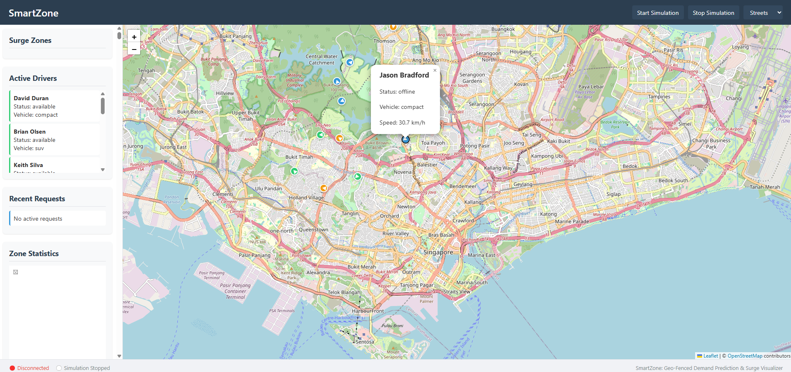

# SmartZone: Geo-Fenced Demand Prediction & Surge Visualizer

A full-stack geospatial intelligence platform that mimics how ride-sharing companies like Grab manage high-demand areas using geospatial data.

## Features

- 🗺️ Interactive map visualization with zone partitioning using H3 hexagonal grid cells
- 🚗 Real-time tracking of simulated drivers with smooth animation
- 📊 Dynamic surge pricing based on supply and demand
- 🔔 Geofencing to detect when drivers enter or leave surge zones
- 📈 Historical data analysis and simple demand prediction
- ⚡ Real-time WebSocket communication for live updates
- 🗄️ MongoDB geospatial database for efficient spatial queries

## Technology Stack

- **Backend**: FastAPI with async support
- **Database**: MongoDB with geospatial indexing
- **Frontend**: HTML/CSS/JavaScript with Leaflet.js for mapping
- **Real-time**: WebSockets for live updates
- **Geospatial**: H3 library for hexagonal grid cells

## Prerequisites

- Python 3.8+
- MongoDB 4.2+
- Node.js 14+ (optional, for development)

## Installation

1. Clone the repository:
```bash
git clone https://github.com/yourusername/smartzone.git
cd smartzone
```

2. Create and activate a virtual environment:
```bash
python -m venv venv
source venv/bin/activate  # On Windows: venv\Scripts\activate
```

3. Install dependencies:
```bash
pip install -r requirements.txt
```

4. Install and start MongoDB if not already running:
```bash
# If using Docker:
docker run -d -p 27017:27017 --name mongodb mongo:latest
```

5. Configure environment variables:
   - Copy `.env.example` to `.env`
   - Update values as needed (especially MongoDB connection settings)

## Running the Application

1. Seed the database with initial data:
```bash
python data/seed_data.py
```

2. Start the FastAPI server:
```bash
python app.py
```

3. Open the application in your browser:
```
http://localhost:8000
```

## Using the Dashboard

1. **Start Simulation**: Click the "Start Simulation" button to begin the simulation
2. **Map Navigation**: Zoom and pan to explore different areas
3. **Zone Details**: Click on a zone to see its details (demand level, driver count, etc.)
4. **Driver Tracking**: Watch drivers move around the map in real-time
5. **Surge Zones**: Surge pricing zones are highlighted in red
6. **Change Map Style**: Use the dropdown to switch between different map styles

## Project Structure

- `app.py`: Main application entry point
- `config.py`: Configuration settings
- `backend/`: Backend code
  - `database.py`: MongoDB connection and helpers
  - `models.py`: Pydantic models for data validation
  - `geo_utils.py`: Geospatial utility functions
  - `simulation.py`: Data simulation logic
  - `routes/`: API and WebSocket routes
    - `api.py`: REST API endpoints
    - `websocket.py`: WebSocket handlers
  - `services/`: Business logic services
    - `geofencing.py`: Geofencing detection
    - `surge_detection.py`: Surge pricing logic
    - `prediction.py`: Demand prediction with ML
- `frontend/`: Frontend code
  - `static/`: Static assets (JavaScript, CSS)
    - `js/`: JavaScript files
      - `map.js`: Map rendering and interactions
      - `websocket.js`: WebSocket client
      - `ui.js`: UI controls and displays
    - `css/`: Stylesheets
  - `templates/`: HTML templates
- `data/`: Data scripts and sample data
  - `seed_data.py`: Data generation script
- `tests/`: Test files

## API Endpoints

### Zones

- `GET /api/zones`: Get all zones with their current status
- `GET /api/zones/{zone_id}`: Get a specific zone
- `POST /api/initialize-zones`: Initialize zones for a city center

### Drivers

- `GET /api/drivers`: Get all drivers
- `GET /api/drivers/{driver_id}`: Get a specific driver

### Ride Requests

- `GET /api/ride-requests`: Get all ride requests
- `GET /api/ride-requests/{request_id}`: Get a specific ride request

### Simulation

- `POST /api/simulation/start`: Start the simulation
- `POST /api/simulation/stop`: Stop the simulation

### Statistics

- `GET /api/stats/surge-history`: Get surge history for the past X hours
- `GET /api/stats/demand-by-zone`: Get current demand levels for all zones

### Geospatial

- `GET /api/geospatial/drivers-in-bounds`: Get drivers within map bounds
- `GET /api/geospatial/requests-in-bounds`: Get ride requests within map bounds

## WebSocket Events

The application uses WebSockets for real-time updates. The following message types are supported:

- `driver_updates`: Updates on driver positions and status
- `zone_updates`: Updates on zone demand levels and surge status
- `request_updates`: Updates on ride requests


## How to Run the Project

- Install dependencies: `pip install -r requirements.txt`
- Set up MongoDB (locally or using Docker)
- Run the seed script: `python data/seed_data.py`
- Start the server: `python app.py`
- Open your browser to `http://localhost:8000`

## Preview

